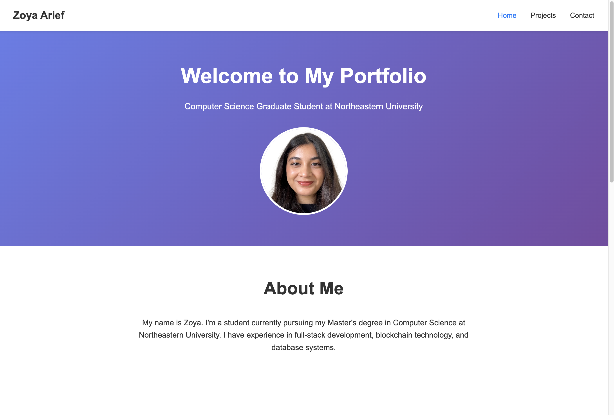

# Zoya Arief - Portfolio Website

## Author
**Zoya Arief**
Master of Science in Computer Science
Northeastern University
Email: arief.z@northeastern.edu

## Project Objective
This project is a personal portfolio website showcasing my education, technical skills, and projects as a Computer Science graduate student. The website demonstrates proficiency in vanilla HTML5, CSS3, and ES6+ JavaScript, featuring a clean, responsive design with interactive elements and animations.

## Screenshot


## Features
- **Responsive Design**: Mobile-friendly layout using CSS Grid and Flexbox
- **Interactive Navigation**: Smooth transitions and active state indicators
- **Project Showcase**: Detailed project descriptions with hover effects and search functionality
- **Contact Form**: Validated contact form with real-time feedback
- **AI-Generated Content**: Contact page is AI generated.
- **ES6+ JavaScript**: Modern JavaScript with modules, arrow functions, and async operations
- **Accessibility**: Semantic HTML with proper alt attributes and ARIA labels

## Technologies Used
- **HTML5**: Semantic markup and modern web standards
- **CSS3**: Grid, Flexbox, animations, and responsive design
- **JavaScript ES6+**: Modules, arrow functions, destructuring, and modern APIs
- **Web APIs**: Intersection Observer, DOM manipulation
- **Development Tools**: Prettier, ESLint, Live Server

## Project Structure
```
├── index.html              # Main homepage
├── projects.html           # Projects showcase page
├── contact.html            # Contact form page ( AI generated)
├── css/
│   └── styles.css         # Main stylesheet
├── js/
│   ├── main.js            # Homepage functionality
│   ├── projects.js        # Projects page interactions
│   ├── contact.js         # Contact form validation ( AI generated)
├── images/
│   ├── Headshot.PNG      # Profile picture
│   ├──Main_page.PNG       # Project screenshots
├── package.json           # Project dependencies and scripts
├── .eslintrc.js          # ESLint configuration
├── .prettierrc           # Prettier configuration
├── LICENSE               # MIT license
└── README.md            # This file
```

## Instructions to Build

### Prerequisites
- Node.js (version 16.0.0 or higher)
- npm (comes with Node.js)

### Installation
1. **Clone the repository**
   ```bash
   git clone https://github.com/zoyaarief/my_portfolio.git
   cd my_portfolio
   ```

2. **Install dependencies**
   ```bash
   npm install
   ```

3. **Start the development server**
   ```bash
   npm start
   ```
   This will start a live server on `http://localhost:3000`

### Development Commands
- `npm run dev` - Start development server with auto-reload
- `npm run format` - Format code with Prettier
- `npm run lint` - Check code with ESLint
- `npm run validate` - Validate HTML markup

### Deployment
The website is a static site and can be deployed to any web server or hosting platform:

1. **GitHub Pages**: Push to a GitHub repository and enable GitHub Pages
2. **Netlify**: Connect your repository for automatic deployment
3. **Vercel**: Import your project for instant deployment

## Design Decisions
- **Minimal Design**: Clean, professional aesthetic focusing on content
- **Blue Color Scheme**: Consistent brand colors throughout the site
- **Gradient Hero**: Eye-catching header to make a strong first impression
- **Card-based Layout**: Organized content in easy-to-scan sections
- **Smooth Animations**: Subtle transitions to enhance user experience

## Use of GenAI Tools
Used Gen ai tool to develop and create the last html page : the contact page
### Claude AI (Anthropic)
**Model**: Claude Sonnet 4
**Version**: Latest available (September 2024)

**Usage**:
1. **Code Structure**: Used Claude to generate the initial HTML structure and CSS for the contact page.
2.
**Prompts Used**:
- " create a simple contact page for a portfolio assignment"

**How it was used**:
- Generated initial code structure and boilerplate
-
All generated code was reviewed, customized, and integrated to meet specific project requirements and maintain consistency with personal branding.

## License
This project is licensed under the MIT License - see the [LICENSE](./LICENSE.txt) file for details.

## Contact
- **Email**: arief.z@northeastern.edu
- **LinkedIn**: [Zoya Arief](#https://www.linkedin.com/in/zoya-arief)
- **GitHub**: [Zoya Arief](#https://github.com/zoyaarief)

---

